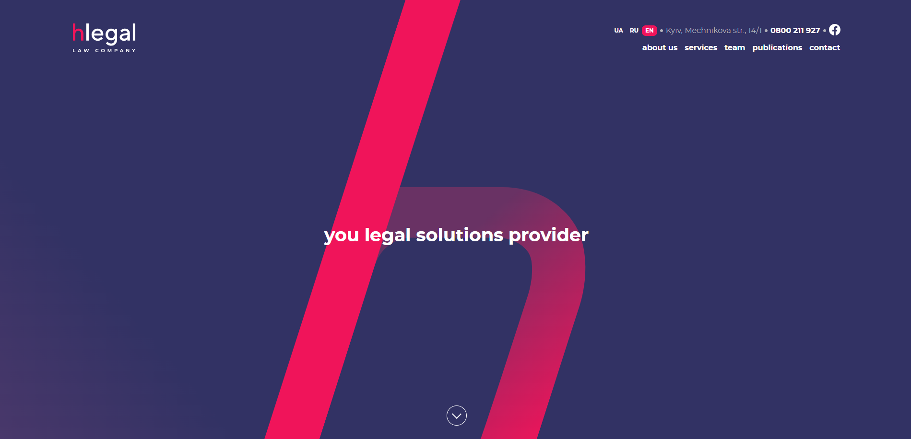

# HLegal
HLegal is a responsive website using HTML/CSS, SASS, and JavaScript, optimized with GULP. Implemented clean code, streamlined styling, and automation for a smooth user experience.

### JavaScript Functionalities
1. Header Navigation Toggle;
2. Tabs Functionality;
3. Team Slider;
4. Achievement Slider;
5. Popup Form;

### Technologies Used
- Gulp;
- SASS;

### Demo
Live view by clicking the link: https://hlegal-2023.netlify.app/

You can also clone the project and open it in localhost, or enjoy the preview video below instead

### Getting Started

To run Todo-App locally, follow these steps:
1. Clone the repo: git clone https://github.com/olhasashchuk/Hlegal.git;
2. Install dependencies using `npm install`;
3. Start the development server using `gulp`;
4. The dev server will start on http://localhost:3002 to view the application.

### Contributing

Contributions are welcome! If you find any bugs or have suggestions for improvements, please open an issue or submit a pull request.